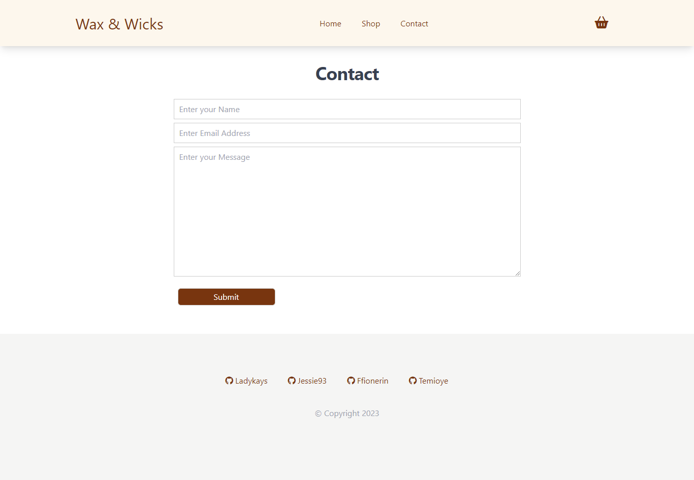

# Wax and Wicks e-commerce website

## Table of Content

- [Description](#description)
- [Technologies used](#technologies-used)
- [Screenshot of deployed site](#screenshot-of-deployed-site)
- [Link to deployed site](#screenshot-of-deployed-site)
- [Contributors](#contributors)

## Description

Our e-commerce website, Wax and Wicks, is designed to cater to candle enthusiasts who seek to buy high-quality candles online. Our website boasts a sleek and user-friendly interface that provides an easy and enjoyable shopping experience. Our website features a navigation bar that allows users to move effortlessly throughout the site. Our home page offers inspiration for various occasions, while our shop page allows users to easily browse and add candles to their baskets. The basket page provides a summary of the user's selected candles, and users can view their total from this page, either continuing shopping or proceeding to the checkout page. Our checkout page provides a step-by-step guide to complete the purchase, where a user can input their address and payment information. 

## Technologies used

* React.js
* Node.js
* MUI
* Tailwind CSS

## Screenshot of deployed site

## Link to deployed site

You can find our website deployed on Netlify:

https://jocular-empanada-77cf44.netlify.app/

## Contributors

[ladykays](https://github.com/ladykays)

[Jessie93](https://github.com/Jessie93)

[ffionerin](https://github.com/username/ffionerin)

[Temioye](https://github.com/Temioye)

____________________________

# REACT INFO

## Available Scripts

In the project directory, you can run:

### `npm start`

Runs the app in the development mode.\
Open [http://localhost:3000](http://localhost:3000) to view it in your browser.

The page will reload when you make changes.\
You may also see any lint errors in the console.

### `npm test`

Launches the test runner in the interactive watch mode.\
See the section about [running tests](https://facebook.github.io/create-react-app/docs/running-tests) for more information.

### `npm run build`

Builds the app for production to the `build` folder.\
It correctly bundles React in production mode and optimizes the build for the best performance.

The build is minified and the filenames include the hashes.\
Your app is ready to be deployed!

See the section about [deployment](https://facebook.github.io/create-react-app/docs/deployment) for more information.

### `npm run eject`

**Note: this is a one-way operation. Once you `eject`, you can't go back!**

If you aren't satisfied with the build tool and configuration choices, you can `eject` at any time. This command will remove the single build dependency from your project.

Instead, it will copy all the configuration files and the transitive dependencies (webpack, Babel, ESLint, etc) right into your project so you have full control over them. All of the commands except `eject` will still work, but they will point to the copied scripts so you can tweak them. At this point you're on your own.

You don't have to ever use `eject`. The curated feature set is suitable for small and middle deployments, and you shouldn't feel obligated to use this feature. However we understand that this tool wouldn't be useful if you couldn't customize it when you are ready for it.

## Learn More

You can learn more in the [Create React App documentation](https://facebook.github.io/create-react-app/docs/getting-started).

To learn React, check out the [React documentation](https://reactjs.org/).

### Code Splitting

This section has moved here: [https://facebook.github.io/create-react-app/docs/code-splitting](https://facebook.github.io/create-react-app/docs/code-splitting)

### Analyzing the Bundle Size

This section has moved here: [https://facebook.github.io/create-react-app/docs/analyzing-the-bundle-size](https://facebook.github.io/create-react-app/docs/analyzing-the-bundle-size)

### Making a Progressive Web App

This section has moved here: [https://facebook.github.io/create-react-app/docs/making-a-progressive-web-app](https://facebook.github.io/create-react-app/docs/making-a-progressive-web-app)

### Advanced Configuration

This section has moved here: [https://facebook.github.io/create-react-app/docs/advanced-configuration](https://facebook.github.io/create-react-app/docs/advanced-configuration)

### Deployment

This section has moved here: [https://facebook.github.io/create-react-app/docs/deployment](https://facebook.github.io/create-react-app/docs/deployment)

### `npm run build` fails to minify

This section has moved here: [https://facebook.github.io/create-react-app/docs/troubleshooting#npm-run-build-fails-to-minify](https://facebook.github.io/create-react-app/docs/troubleshooting#npm-run-build-fails-to-minify)
